# Manuale Amministratore — Gestimus

> **Versione manuale**: 2.0
> **Data**: 23 maggio 2026
> **Destinatari**: Amministratori di tenant Gestimus (conservatori, accademie, festival, enti che organizzano concorsi musicali).
> **Lingua interfaccia**: italiano, inglese, francese, spagnolo (vedi cap. 14).
> **Stack attuale**: Fastify 5 + PostgreSQL 18 + Drizzle ORM (migrato da PocketBase a maggio 2026).

Questo manuale spiega come configurare e condurre un concorso musicale completo con Gestimus dal punto di vista dell'**amministratore di tenant** (ruolo `admin`). Non è un manuale di installazione: per setup e deploy fare riferimento a `README.md`, `server/README.md` e `docs/DEPLOY-IONOS.md`.

> **Novità v2.0** (rispetto a v1.0 PocketBase):
> - **Presidente per-commissione**, non più per-concorso. Ogni commissione ha il proprio presidente, che può avviare/concludere/sortire le SUE fasi (oltre all'admin).
> - **Modello candidato N:1**: un candidato appartiene a una sola sezione e una sola categoria. Selezionando una categoria, la sezione padre viene auto-derivata.
> - **Form pubblico iscrizione esteso**: anagrafica completa (sesso, CF, luogo nascita), residenza (indirizzo, città, CAP, provincia, paese), dati artistici (anni di studio, scuola di provenienza), note libere, nome gruppo.
> - **Tab Impostazioni concorso inline**: il pannello "Modifica concorso" è embedded nella tab Impostazioni (niente più modale). Eliminazione concorso con **doppia conferma type-to-delete** in stile GitHub.
> - **Branding ente**: logo + colori + contatti gestiti dalla home (`Impostazioni ente`), salvati in JSONB con merge server-side.
> - **Voti decimali**: scala ≤ 10 supporta mezzi punti (`numeric(5,2)` lato DB).
> - **Verbale**: nuovo tag `<fase_presidente>`, firme nel PDF stampate solo se il template referenzia tag commissione/commissari E la fase ha commissione assegnata.

## Indice

1. [Introduzione](#1-introduzione)
2. [Accesso, account e ruoli](#2-accesso-account-e-ruoli)
3. [Concorso: creazione e selezione](#3-concorso-creazione-e-selezione)
4. [Sezioni e categorie](#4-sezioni-e-categorie)
5. [Commissari](#5-commissari)
6. [Commissioni](#6-commissioni)
7. [Fasi (cuore del manuale)](#7-fasi-cuore-del-manuale)
8. [Iscrizioni](#8-iscrizioni)
9. [Candidati](#9-candidati)
10. [Risultati](#10-risultati)
11. [Audit log](#11-audit-log)
12. [Impostazioni del tenant](#12-impostazioni-del-tenant)
13. [Dashboard e statistiche](#13-dashboard-e-statistiche)
14. [Multi-lingua](#14-multi-lingua)
15. [Sicurezza e integrità dati](#15-sicurezza-e-integrita-dati)
16. [Calendario e scheduling](#16-calendario-e-scheduling)
17. [FAQ e troubleshooting](#17-faq-e-troubleshooting)

<!-- page-break -->

## 1. Introduzione

Gestimus è un gestionale SaaS multitenant pensato per **concorsi musicali a fasi multiple**: dalle audizioni di un singolo conservatorio fino ai concorsi internazionali con eliminatoria + semifinale + finale, più tracce parallele per sezione (archi, fiati, pianoforte, canto, musica da camera).

### 1.1 Scenari d'uso tipici

- **Conservatori e accademie**: audizioni interne, esami di ammissione, premi annuali.
- **Concorsi nazionali e internazionali**: gare a fasi con commissioni multiple, anonimato del candidato, sorteggio dell'ordine, programma di sala.
- **Festival e rassegne musicali**: iscrizioni pubbliche on-line, valutazioni in differita o live, podio e protocollo finale.

### 1.2 Ruoli

Gestimus distingue tre ruoli nella collezione `accounts`:

- **`superadmin`** — amministratore della piattaforma SaaS (un livello sopra al tenant). Gestisce piani, scadenze, creazione tenant. Non è normalmente operativo nel singolo concorso.
- **`admin`** — amministratore di tenant. È il destinatario di questo manuale: configura concorsi, sezioni, commissioni, fasi, iscrizioni, esporta verbali.
- **`commissario`** — giurato della commissione. Vota i candidati. Se è anche **presidente** di una commissione, ottiene il pannello di controllo sessione (avvio/conclusione fase, timer condiviso, conferma di chiusura).

> **Nota**: il "presidente" non è un ruolo separato a livello account — è un attributo della singola commissione (`commissioni.presidente`). Un commissario può essere presidente di una commissione e semplice membro in un'altra.

### 1.3 Architettura semplificata

- **Frontend**: applicazione web vanilla JS, SPA con hash-routing (`#/`, `#/admin`, `#/commissario`, `#/iscrizione`). Service worker per PWA e fallback offline; aggiornamenti realtime via Server-Sent Events.
- **Backend**: singolo processo Node.js 22 + Fastify 5 + Drizzle ORM su PostgreSQL 18. Integrità garantita da middleware (`assertCanManageFase`, `requireAdmin`), trigger DB (`clamp_voto`, freeze fase CONCLUSA) e validazione Zod sulle route REST.
- **Multitenant**: un solo processo Node + un solo database Postgres condiviso, con isolamento per `tenant_id` via Row-Level Security. Provisioning/sospensione/archiviazione dei tenant interamente dalla UI super-admin (vedi `docs/MIGRATION_POSTGRES.md` per i dettagli).


<!-- page-break -->

## 2. Accesso, account e ruoli

### 2.1 Login

L'accesso avviene dalla pagina pubblica con email + password. Sul lato sinistro compare il branding pubblico del tenant (logo + nome ente), sul lato destro il form.

1. Aprire l'URL del tenant.
2. Inserire **email** e **password** dell'account admin.
3. Cliccare *Accedi*.
4. Il sistema indirizza automaticamente alla dashboard giusta in base al ruolo: `admin` → home con selettore concorso, `commissario` → vista commissario, `superadmin` → console superadmin.

> **Primo avvio**: il primo super-admin si crea via Drizzle direttamente dal database (one-shot durante il provisioning), poi i super-admin successivi si creano dalla console super-admin. L'admin del singolo tenant viene creato dal super-admin tramite UI.

### 2.2 Gestione account dalla tab "Utenti"

La tab **Utenti** (sidebar admin → sezione "Admin") elenca tutti gli account del tenant con email, nome, ruolo, stato attivo/disattivato, e l'eventuale commissario collegato.

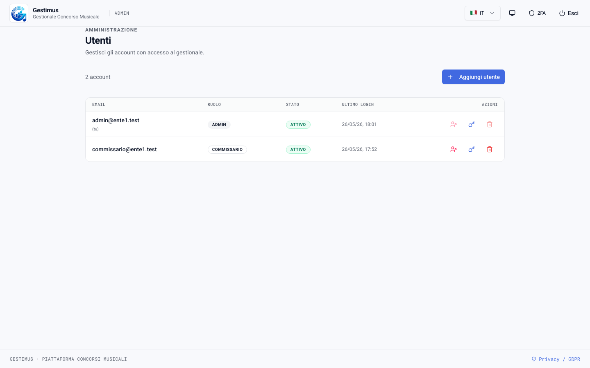

Azioni disponibili per ogni riga:

- **Attiva/Disattiva** (icona check/x): un account disattivato non può più fare login (`accounts.attivo = false`).
- **Reset password** (icona chiave): apre un prompt per inserire la nuova password (minimo 6 caratteri).
- **Elimina** (icona cestino): rimuove definitivamente l'account.

Per creare un nuovo utente cliccare *Aggiungi utente* in alto a destra. Il sistema impedisce di creare due account con la stessa email (vincolo unique su `accounts.email` lato DB).

### 2.3 Reset password — come funziona

Il reset password **non passa per email**: la collezione `accounts` è gestita dall'admin del tenant, che imposta direttamente la nuova password. Operazione registrata nell'audit (`account.password_reset`).

> **Avvertenza**: il reset password eseguito dall'admin aggiorna direttamente l'hash Argon2id sul record `accounts`, senza richiedere la password precedente. Operazione registrata in audit con `account.password_reset` (e `account.password_reset_failed` in caso di errore DB).

### 2.4 Permessi sintetici

| Operazione | superadmin | admin | commissario | presidente di commissione |
| --- | :-: | :-: | :-: | :-: |
| Login | ✓ | ✓ | ✓ | ✓ |
| Creare/eliminare concorsi | ✓ | ✓ | — | — |
| Creare/modificare account | ✓ | ✓ | self (solo password/nome) | self |
| Creare/modificare fasi | ✓ | ✓ | — | — |
| Avviare/concludere una fase | ✓ | ✓ | — | ✓ (solo le proprie) |
| Inserire/modificare voti | — | — | ✓ | ✓ |
| Modificare voti dopo CONCLUSA | — | — | — | — |
| Approvare iscrizioni | ✓ | ✓ | — | — |

### 2.5 Sicurezza account — autenticazione a due fattori (2FA)

Ogni utente può proteggere il proprio account con un secondo fattore TOTP (Google Authenticator, Authy, 1Password, ecc.) dalla vista **Sicurezza account**.

1. Aprire *Sicurezza account* (menu account).
2. Cliccare *Attiva 2FA*: compare un **QR code** (e la chiave in chiaro come fallback) da inquadrare con l'app authenticator.
3. Inserire il codice a 6 cifre generato dall'app per confermare l'attivazione.
4. Salvare i **codici di recupero** mostrati una sola volta: servono per accedere se si perde il dispositivo.

Da quel momento il login richiede password **+** codice TOTP. Per disattivare il 2FA serve un codice valido (o un codice di recupero). Il super-admin può richiedere il 2FA per gli account del tenant. Attivazione/disattivazione sono registrate in audit.

<!-- page-break -->

## 3. Concorso: creazione e selezione

### 3.1 Selettore concorso

Quando l'admin accede e non c'è un concorso attivo selezionato, compare il **selettore concorso**: una griglia di card una per concorso (nome, anno, stato, conteggi candidati/fasi/commissari) più una card "tratteggiata" *Nuovo concorso*.

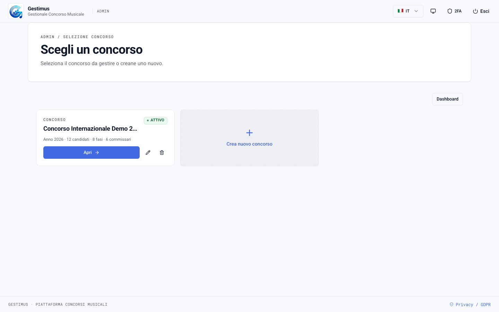

- **Apri** entra nell'area admin del concorso (sidebar visibile con tutte le tab).
- **Modifica** (icona matita) apre la modale per cambiare nome/anno/stato/logo/anonimato/iscrizioni.
- **Elimina** (icona cestino) cancella il concorso e tutti i dati collegati in cascata (fasi, candidati, commissari, sezioni, commissioni, valutazioni). Operazione confermata e registrata nell'audit.

> **Cambio concorso**: dalla sidebar admin, in basso, il pulsante *Cambia concorso* torna al selettore senza eliminare nulla. Il concorso attivo è persistito in localStorage (`gestionale_meta_v2.activeConcorsoId`).

### 3.2 Wizard "Nuovo concorso"

Il form è semplice e ha quattro campi:

```
Nome             (obbligatorio)   es. Concorso Internazionale 2026
Anno             (obbligatorio)   2000–2100
Data inizio      (opzionale)      date picker
Logo             (opzionale)      file immagine, ridimensionato a 800 px
Modalità anonima (checkbox)       nasconde nome/foto/età ai commissari
```

Alla conferma il concorso viene creato con stato `ATTIVO`, marcato come attivo nella sessione, e l'app entra nella sua area admin.

### 3.3 Modalità anonima

Attivando la modalità anonima (`concorso.anonimo = true`), nella vista commissario:

- nome, cognome, età, nazionalità e foto del candidato non vengono mostrati;
- al loro posto compare il solo numero candidato (es. `#012`) e la dicitura "Candidato anonimo";
- nei verbali e nei PDF il dato anagrafico resta comunque per l'admin.

Usare questa modalità per concorsi che richiedono giudizio strettamente impersonale.

### 3.4 Logo, anno e branding del singolo concorso

Il logo del concorso è separato dal logo dell'ente (vedi cap. 12). Compare:

- nell'header amministrativo del concorso,
- nel PDF protocollo e nel PDF verbale (in alto a sinistra).

Se il logo del concorso manca, viene usato `./logo.png` (logo applicativo). L'anno è obbligatorio e compare in tutti gli export.

### 3.5 Iscrizioni pubbliche

Nella modale di modifica concorso, in fondo, c'è il blocco *Iscrizioni pubbliche*:

- **Accetta iscrizioni dal frontend pubblico** — toggle che apre/chiude il form `#/iscrizione`;
- **Data/ora di chiusura iscrizioni** — opzionale. Oltre quella scadenza il form chiude automaticamente, anche se il flag è ancora attivo.

Vedi cap. 8 per il dettaglio del flusso iscrizioni.

<!-- page-break -->

## 4. Sezioni e categorie

### 4.1 Concetto

Le **sezioni** sono i grandi raggruppamenti del concorso (es. *Archi*, *Fiati*, *Pianoforte*, *Canto*, *Musica da Camera*). Ogni sezione può avere zero o più **categorie** (es. *Senior 18-30*, *Junior 12-17*, *Ottoni*, *Legni*). La struttura è gerarchica: categoria → sezione → concorso.

Le sezioni hanno tre usi pratici:

1. **Scope delle fasi** — una fase può essere ristretta a una o più sezioni (vedi cap. 7) per creare tracce parallele.
2. **Assegnazione alle commissioni** — una commissione è collegata a sezioni e categorie specifiche (vedi cap. 6).
3. **Tagging dei candidati** — ogni candidato può appartenere a una o più sezioni/categorie (vedi cap. 9).

### 4.2 Tab Sezioni

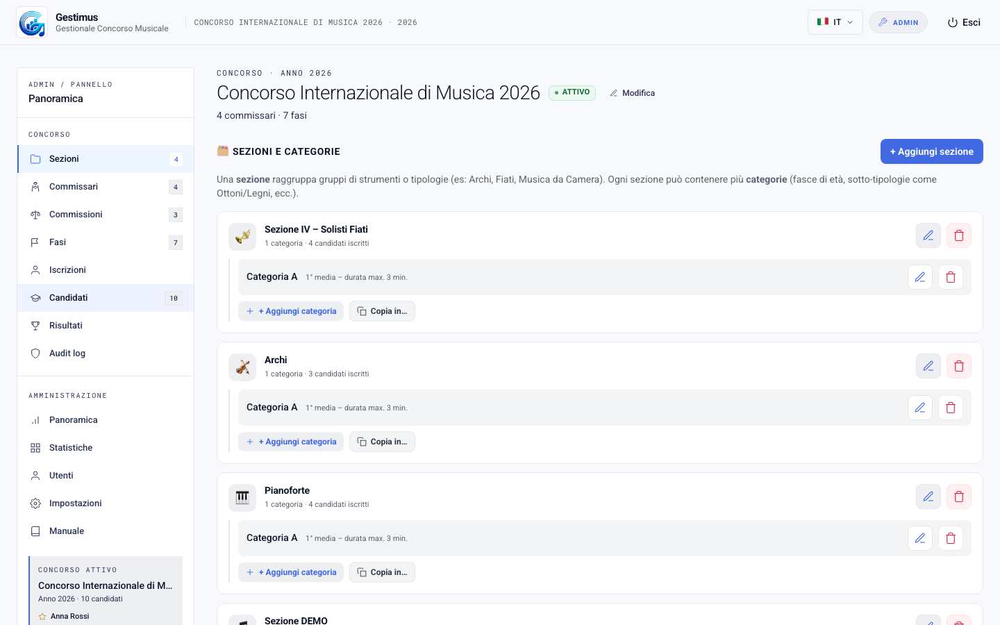

La tab mostra ogni sezione come card con:

- icona dello strumento (assegnata automaticamente in base al nome: 🎻 archi, 🎺 fiati/ottoni, 🎷 legni, 🎹 pianoforte, 🎤 canto, 🥁 percussioni, 🎸 chitarra, 🎼 coro/composizione, ecc.);
- nome e descrizione;
- conteggio categorie e conteggio candidati associati;
- elenco delle categorie figlie con pulsanti "modifica" e "elimina";
- pulsante *+ Categoria* per aggiungere una nuova categoria alla sezione;
- pulsante *Copia in…* per replicare le categorie di una sezione in una o più altre sezioni (utile quando archi/fiati hanno la stessa partizione Junior/Senior).

### 4.3 Creare una sezione

1. Tab *Sezioni* → *Aggiungi sezione*.
2. Inserire **Nome** (obbligatorio, es. "Pianoforte") e **descrizione** (opzionale).
3. Salvare. L'icona dello strumento viene scelta automaticamente.

### 4.4 Creare una categoria

1. Dalla card della sezione cliccare *+ Categoria*.
2. Inserire **Nome** (es. "Junior 14-17") e **descrizione** opzionale.
3. Salvare.

### 4.5 Copia categorie tra sezioni

1. Card sezione sorgente → *Copia in…*.
2. Spuntare le sezioni di destinazione.
3. Opzionale: spuntare *Salta categorie con nome già presente nella destinazione* (consigliato, evita duplicati case-insensitive).
4. Confermare. Il sistema mostra un toast con `N copiate, M saltate`.

### 4.6 Eliminazione

Eliminare una sezione richiede conferma e cancella in cascata le categorie figlie. Eliminare una categoria che è già stata usata da candidati la rimuove dal loro tagging.

> **Suggerimento**: prima di eliminare una sezione, verifica con la tab *Risultati* se ci sono fasi con scope su di essa. Le fasi orfane (con `sezioni_ids` puntate a una sezione cancellata) sopravvivono ma diventano "tutte le sezioni" all'atto pratico.

<!-- page-break -->

## 5. Commissari

### 5.1 Tab Commissari

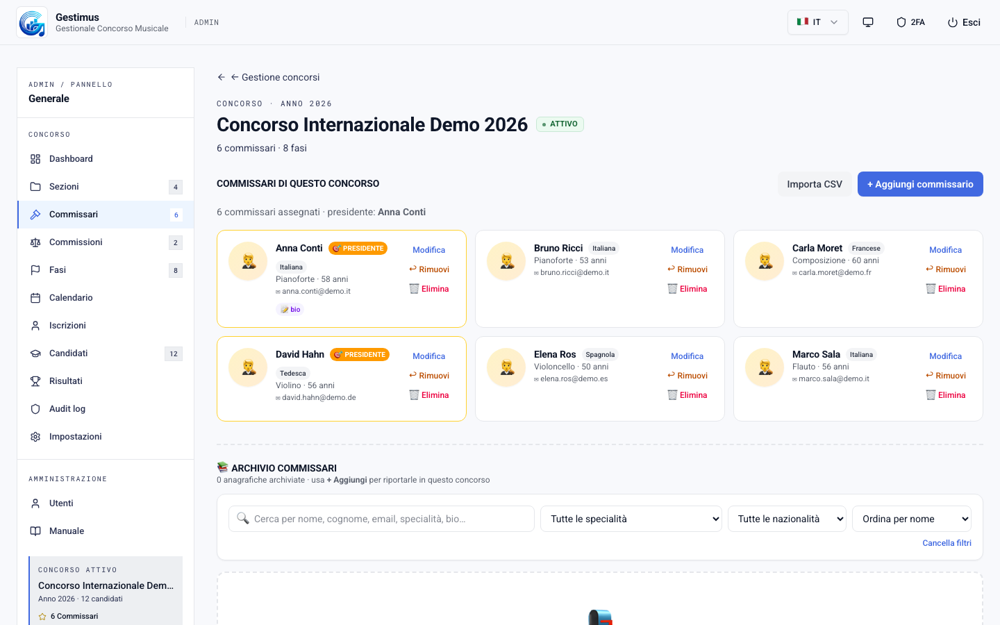

La tab mostra:

- in alto: contatore commissari, eventuale warning *Nessun presidente assegnato*, pulsanti *Importa* (CSV/TSV) e *Aggiungi*;
- una griglia di card commissario con foto, nome, specialità, età, email, telefono, badge presidente (se è presidente di almeno una commissione), badge CV se è presente un CV PDF, badge bio se compilata;
- in fondo: la sezione **Archivio** (vedi 5.4) con i commissari deduplicati da tutti i concorsi del tenant.

### 5.2 Anagrafica commissario

Il form di creazione/modifica raccoglie:

- **Nome** e **cognome** (obbligatori),
- **Specialità** (obbligatoria, es. "Pianoforte", "Composizione"),
- **Data di nascita**, **nazionalità** (opzionali, con datalist precompilata),
- **Email** e **telefono** (opzionali ma raccomandati per creare l'account collegato),
- **Foto** (auto-ridimensionata a 480 px),
- **CV** in PDF (visualizzabile in app dal pulsante *CV* sulla card),
- **Bio** (testo libero).

Una sezione opzionale del form permette di **creare contestualmente un account utente** per il commissario (con generatore di password). La password generata viene mostrata una sola volta in una modale che invita a salvarla / inviarla al commissario.

### 5.3 Stato attivo/inattivo

Il campo `stato` dei commissari accetta `ATTIVO` o `INATTIVO`. Un commissario inattivo:

- viene escluso dal conteggio dei valutatori in una fase IN_CORSO (la barra "commissari che hanno completato" non lo aspetta);
- resta visibile nelle valutazioni storiche per audit.

### 5.4 Archivio commissari globale (fingerprint)

Sotto la lista dei commissari del concorso compare l'archivio: una vista **deduplicata** dei commissari su **tutti i concorsi del tenant**. La deduplicazione usa il *fingerprint* definito in `db.js`:

- **Email coincidente** → considerati la stessa persona (`e:lower(email)`).
- **Email assente** → match su nome + cognome + specialità normalizzati (`n:nome|cognome|specialita`).

Per ogni gruppo viene selezionato il record "canonico" con più campi compilati (foto, CV, bio, ecc.). L'archivio mostra in che concorsi compare e permette di **riusarlo nel concorso attivo** con un click (`importFromArchivio`), evitando di reinserire l'anagrafica.

> **Suggerimento**: per massimizzare la deduplicazione, inserisci sempre l'email del commissario. Lo stesso pianista che fa parte di tre concorsi sarà visto come una sola riga.

<!-- page-break -->

## 6. Commissioni

### 6.1 Concetto

Una **commissione** è un raggruppamento di:

- commissari (1..n, scelti dal pool del concorso),
- sezioni (0..n) e categorie (0..n) di sua competenza,
- un **presidente** designato (uno fra i suoi membri).

Le commissioni sono il punto di aggancio tra le persone (commissari) e le materie (sezioni/categorie). Una fase può essere assegnata a una commissione: solo i suoi membri valutano, e solo il suo presidente può avviarla/concluderla.

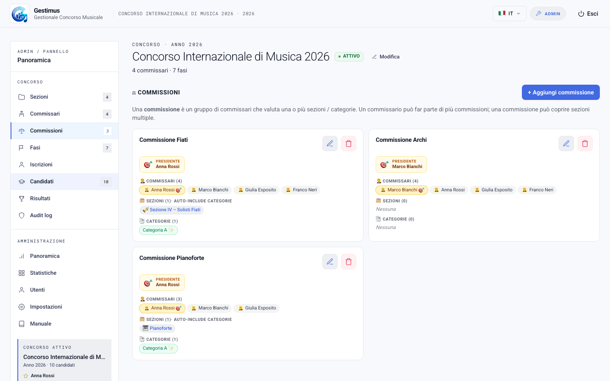

### 6.2 Creare una commissione

1. Tab *Commissioni* → *Aggiungi commissione*.
2. Inserire nome, descrizione opzionale.
3. Selezionare i commissari membri (checkbox multipla).
4. Selezionare le sezioni di competenza.
5. Selezionare le categorie (singole) **oppure** spuntare *Includi tutte le categorie delle sezioni* per estensione automatica.
6. Scegliere il presidente fra i commissari aggiunti.
7. Salvare.

### 6.3 `include_tutte_categorie`

Quando la checkbox "Includi automaticamente tutte le categorie delle sezioni selezionate" è attiva, **al salvataggio** le categorie vengono espanse e attaccate esplicitamente alla commissione (riga in `commissioni_categorie` per ognuna). Il flag in sé non viene persistito: ciò che conta è l'array `categorie_ids` finale. Cambiando le sezioni selezionate, il blocco categoria viene automaticamente ri-sincronizzato.

### 6.4 Presidente — un presidente PER COMMISSIONE *(v2.0)*

Ogni commissione ha **il proprio presidente**. Non esiste più un "presidente del concorso" come ruolo unitario: un commissario può essere presidente di più commissioni dello stesso concorso, oppure di una sola. La card della commissione mostra in alto a destra il presidente con badge 🎯 *Presidente*. Se nessun presidente è designato, compare un warning *Nessun presidente* sulla card.

**Cosa può fare il presidente della commissione X**:
- Avviare/concludere le fasi che hanno `commissione_id = X`
- Gestire timer (start/pause/resume/reset/bonus)
- Eseguire il sorteggio dell'ordine candidati

L'admin del tenant può fare tutto questo per qualsiasi fase. Il presidente solo per le proprie. Le route backend (`/api/fasi/:id/start|conclude|sorteggio|timer/*`) verificano via `assertCanManageFase` che il commissario loggato sia il presidente della commissione assegnata alla fase.

Se la fase NON ha commissione assegnata (`commissione_id = NULL`), solo l'admin può gestirla.

### 6.5 Eliminazione

Eliminare una commissione la rimuove dal database. Le fasi che la usavano restano ma diventano *"tutti i commissari del concorso"* di default. Conviene riassegnare la commissione corretta prima di eliminare la vecchia.

<!-- page-break -->

## 7. Fasi (cuore del manuale)

Le fasi sono il fulcro operativo del gestionale: rappresentano i momenti di valutazione (eliminatoria, semifinale, finale o audizione unica). Gestimus introduce un modello "raggruppato per sezione" che semplifica i concorsi con tracce parallele.

### 7.1 Vista raggruppata per sezione


In alto, una **guida espandibile** spiega il modello (auto-aperta se non ci sono ancora fasi). Sotto, la lista è divisa in **card-gruppo**:

- 🌐 **Fasi globali** — gruppo speciale con `sezioni_ids = []`: si applicano a tutti i candidati indipendentemente dalla sezione.
- 🎻 / 🎺 / 🎹 ... **Una card per sezione** — la "fase madre" è la card stessa (non esiste come record): aggrega le sotto-fasi di quella sezione e mostra i campi condivisi.
- 🔗 **Multi-sezione** (raro) — gruppo che coinvolge più sezioni contemporaneamente.

Ogni card mostra:

- header con titolo (nome sezione o "Fasi globali") + sottotitolo esplicativo;
- **pillole meta** con commissione assegnata, scala di voto, modalità (autonoma/sincrona), tempo per candidato — colorate in viola se condivise, in giallo con ⚠ se divergono fra le sotto-fasi (drift);
- pulsante *⚙ Configurazione condivisa* (visibile se ≥2 sotto-fasi) per batch-edit;
- pulsante *🗑 Elimina gruppo* (cap. 7.5);
- pulsante *+ Aggiungi sotto-fase* (o *Configura fasi* se il gruppo è vuoto, che apre il wizard).

Il corpo della card elenca le **sotto-fasi** in ordine globale, ognuna come riga con: #ordine, nome, stato (PIANIFICATA/IN_CORSO/CONCLUSA), pillole drift dei campi specifici, conteggio candidati ammessi/commissari/criteri, e i bottoni *Avvia / Concludi / Sorteggio / Dettaglio / Modifica / Sposta su–giù / Elimina*.

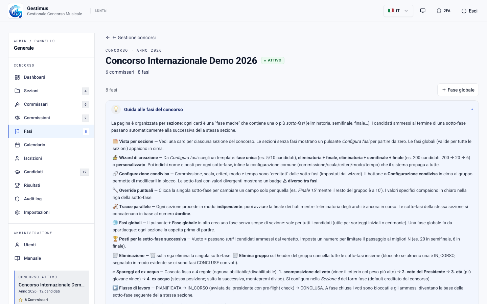

### 7.2 Wizard di creazione fasi

Per le sezioni ancora vuote, il pulsante *Configura fasi* apre il **wizard a tre step**.

**Step 1 — Template**

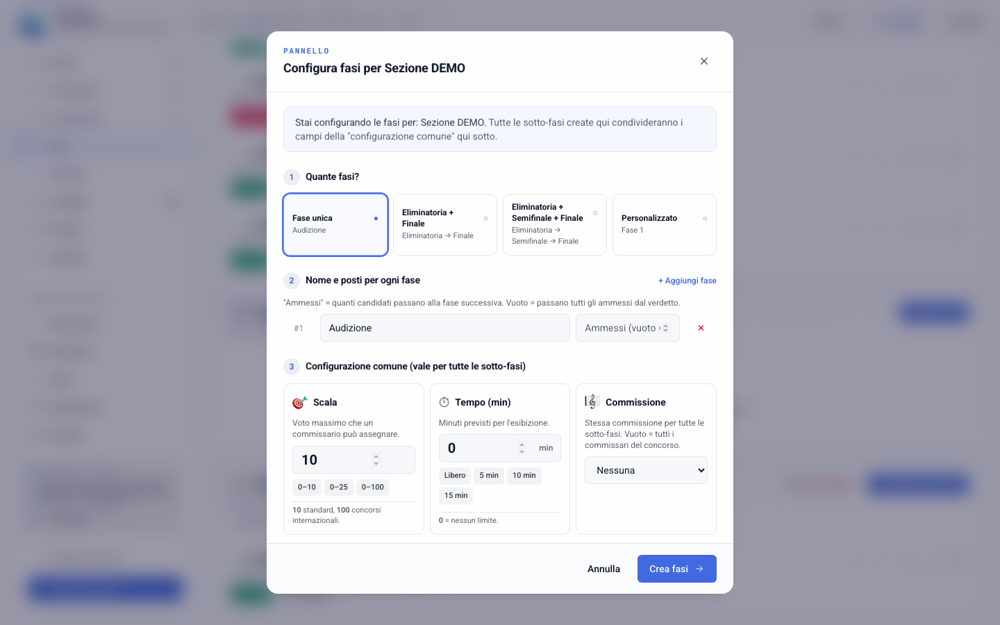

Quattro template preimpostati:

- **Fase unica** — una sola audizione (`Audizione`, senza limite ammessi).
- **Eliminatoria + Finale** — 2 fasi (Eliminatoria con 10 ammessi → Finale aperta).
- **Eliminatoria + Semifinale + Finale** — 3 fasi (20 → 6 → tutti).
- **Personalizzato** — lista vuota, modificabile a mano.

**Step 2 — Nomi e ammessi**

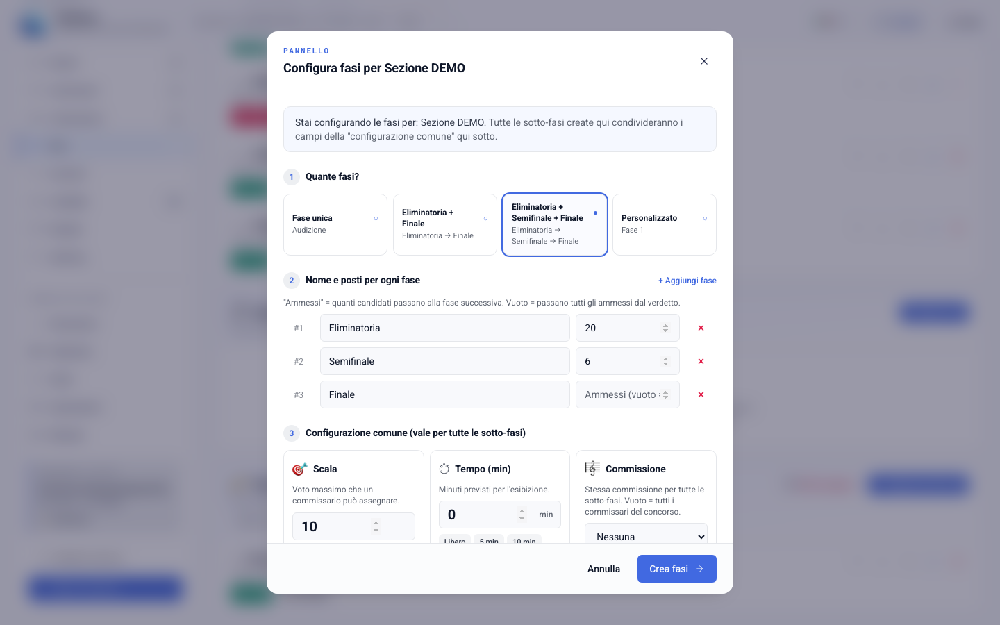

Lista modificabile delle sotto-fasi. Per ognuna:

- **Nome** (es. "Eliminatoria fiati");
- **Ammessi** (numero di candidati che passano alla fase seguente; vuoto = passano tutti gli ammessi dal verdetto della commissione).

Pulsante *+ Aggiungi fase* per aggiungere righe, ❌ per rimuovere. Il wizard impedisce nomi duplicati.

**Step 3 — Configurazione comune**

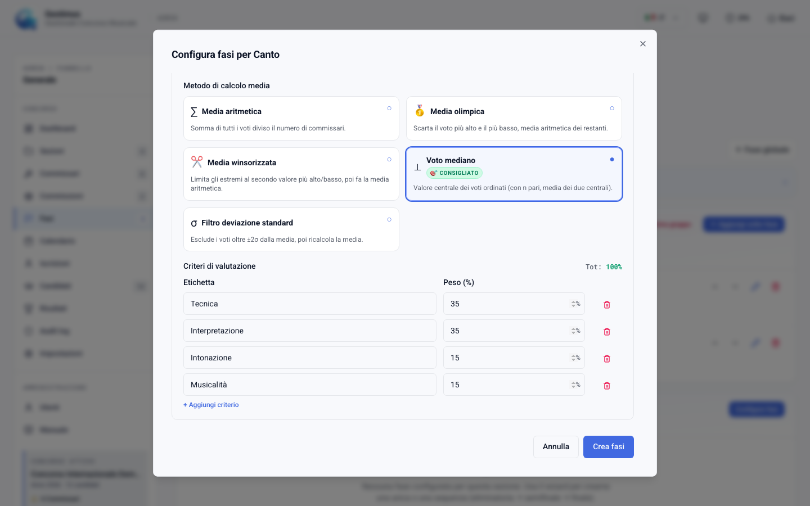

I valori inseriti qui (commissione, scala, tempo, modalità, metodo di media, criteri+pesi) vengono **propagati a tutte le sotto-fasi** create dal wizard. Sono i campi "condivisi" che il batch-edit successivo (7.4) potrà sincronizzare.

Alla conferma, le sotto-fasi vengono create in sequenza con `ordine` globale incrementale e `sezioni_ids` = scope del gruppo.

> **Avvertenza**: se nei criteri la somma dei pesi non è 100%, il wizard chiede una conferma esplicita. Il consiglio è mantenere `Σpesi = 100%` per una media leggibile.

### 7.3 Configurazione di una singola fase (form esteso)

Il form *Modifica fase* è strutturato in cinque sezioni numerate:

1. **Generale** — nome, data prevista.
2. **Modalità di esecuzione** — tre card numeriche (scala di voto, tempo per candidato, posti per la fase successiva) con chip preset cliccabili, più due card di scelta tra **autonoma** e **sincrona**.
3. **Metodo di calcolo della media** — sei card che illustrano i metodi disponibili (vedi 7.6), con il consigliato evidenziato in verde.
4. **Criteri di valutazione** — lista modificabile di criteri (nome + peso %) con totale live in alto a destra.
5. **Restrizione e assegnazione** — chip per le sezioni di scope + dropdown per la commissione assegnata.

#### Scala di voto

Numerica intera o decimale (con step 0,5 fino a scala 10; step 1 oltre). Default 10. Preset rapidi: `0–10`, `0–25`, `0–100`.

> **Suggerimento**: `10` è lo standard nei conservatori italiani; `100` nei concorsi internazionali.

#### Tempo per candidato

Minuti previsti per l'esibizione. Se > 0 attiva un **cronometro condiviso** (vedi 7.8). `0` = nessun limite.

#### Posti per la fase successiva (`ammessi`)

Quanti candidati al massimo passano alla fase seguente. Vuoto = passano tutti quelli ammessi dalla commissione (non c'è cap numerico).

### 7.4 Configurazione condivisa (batch-edit)

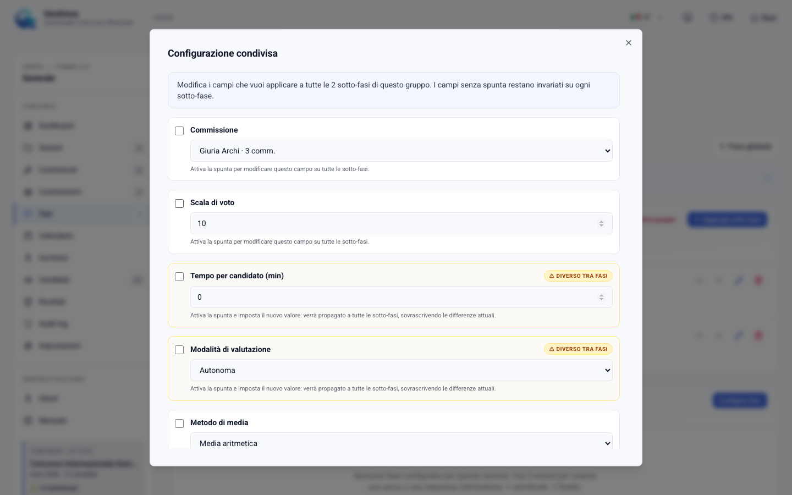

Aprendo *⚙ Configurazione condivisa* su una card-gruppo con ≥2 sotto-fasi, compare una modale con tutti i campi propagabili:

- commissione, scala, tempo per candidato, modalità, metodo di media, criteri.

Per ogni campo c'è una **checkbox**: solo i campi spuntati vengono propagati. I campi che divergono già fra le sotto-fasi sono marcati con badge giallo *⚠ diverso tra fasi*.

Confermando, il sistema esegue gli `update` in parallelo (`Promise.allSettled`) e mostra un toast con `N aggiornate / errori`.

### 7.5 Eliminazione (singola o gruppo)

**Sotto-fase singola**: bottone 🗑 sulla riga. Conferma con avviso che eliminerà anche le valutazioni associate.

- **Bloccato** se la fase è `IN_CORSO` (bottone disabilitato + messaggio).

**Gruppo intero**: bottone *🗑 Elimina gruppo* sull'header della card.

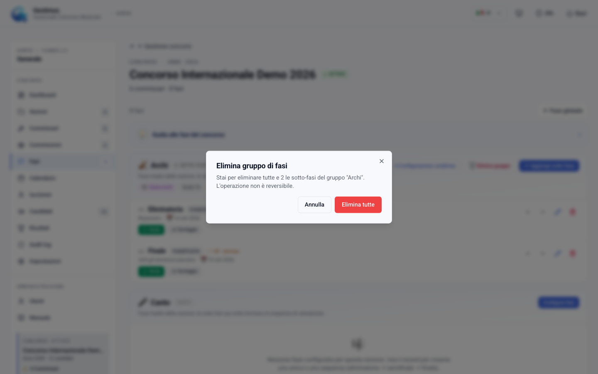

- **Bloccato** se almeno una sotto-fase è `IN_CORSO`.
- **Warning rosso** se ci sono sotto-fasi `CONCLUSE`: l'eliminazione perde tutte le valutazioni registrate.
- La modale elenca le sotto-fasi che verranno eliminate con stato di ognuna.
- L'eliminazione procede sequenziale per evitare race su `state.fasi`; eventuali errori parziali sono riportati.

### 7.6 Drift detection e override

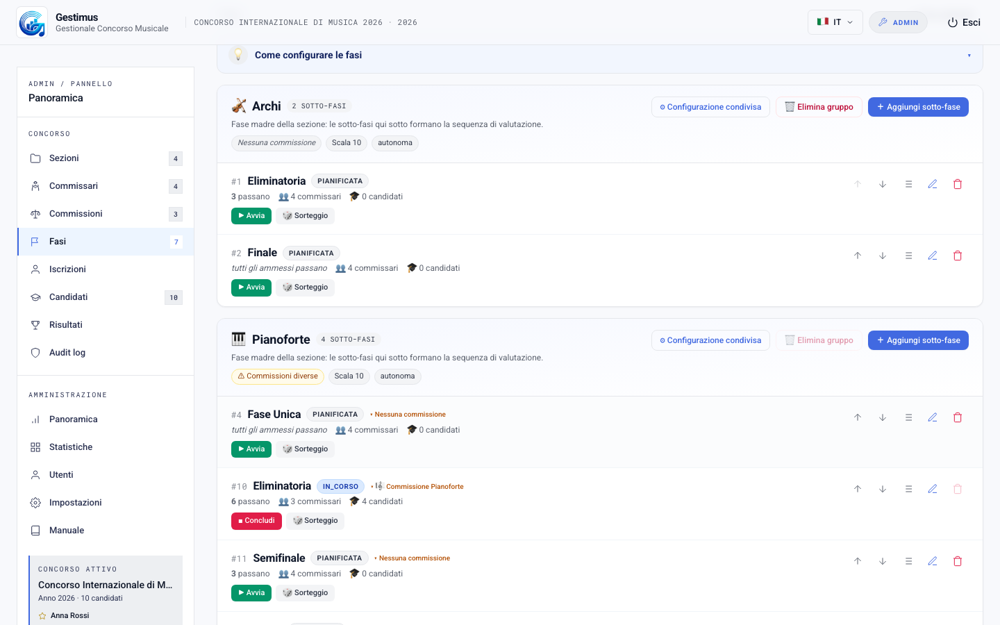

Il sistema confronta i campi condivisi (`commissione_id`, `scala`, `metodo_media`, `modo_valutazione`, `tempo_minuti`, `criteri`) tra le sotto-fasi di un gruppo. Se non coincidono tutti, viene segnalato il **drift**:

- nelle pillole dell'header del gruppo: `⚠ commissioni diverse`, `⚠ scala diff.`, `⚠ modo diff.`, `⚠ tempo diff.`, `⚠ criteri diff.`;
- nelle righe delle sotto-fasi: viene mostrato solo il valore che diverge (es. `▾ scala 25 · 🎼 Giuria Senior`).

Il drift è informativo, non bloccante: ti permette di vedere a colpo d'occhio dove una sotto-fase è stata personalizzata.

### 7.7 Tracce parallele per sezione (esempio)

Supponiamo un concorso con sezioni *Fiati* e *Archi*, e per ognuna vuoi tre fasi (eliminatoria/semifinale/finale). Crei due card-gruppo con il wizard, una per sezione. Il sistema le numera con `ordine` globale (es. 1–3 per Fiati, 4–6 per Archi).

A runtime, `findPreviousFaseInChain(fase)` (in `db.js`) risolve la "fase precedente" così:

- se la fase è **globale** (scope vuoto), considera precedente qualunque fase di ordine inferiore;
- se la fase è **ristretta a sezione X**, considera precedente solo le fasi globali **oppure** quelle che condividono almeno una sezione con X.

In questo modo, *Finale Archi* (ordine 6) non aspetta che *Semifinale Fiati* (ordine 2) sia conclusa, perché appartengono a tracce diverse. Ogni sezione procede al proprio ritmo.

> **Suggerimento**: il numero `#ordine` è solo un'etichetta di sequenzialità globale; quello che conta operativamente è lo scope di sezione.

### 7.8 Flusso di vita di una fase

Una fase passa per tre stati: `PIANIFICATA` → `IN_CORSO` → `CONCLUSA`.

**Avvio (`PIANIFICATA` → `IN_CORSO`)**

Solo il **presidente della commissione assegnata** alla fase può avviarla (regola garantita lato server dal middleware `assertCanManageFase` in `server/src/routes/fasi.ts`). L'admin può sempre avviare da pannello, ma il presidente è il "driver" in produzione.

All'avvio:

1. Viene eseguito un **pre-flight check** (cap. 7.9) che verifica commissione, criteri, fase precedente conclusa, candidati attesi.
2. Vengono create le righe `candidati_fase` per tutti i candidati attesi (quelli ammessi dalla fase precedente, o tutti i candidati del concorso filtrati per scope di sezione se è la prima fase).
3. La fase passa a `IN_CORSO`, l'azione viene registrata nell'audit (`fase.start`).

**Conclusione (`IN_CORSO` → `CONCLUSA`)**

Il presidente, dal suo pannello, vede le statistiche di completamento (candidati valutati, commissari che hanno finito). Cliccando *Concludi fase*:

- modale di conferma con stato avanzamento e checkbox di responsabilità ("Confermo di voler chiudere la fase e generare il verbale");
- al confermare, la fase passa a `CONCLUSA` e il timer condiviso viene azzerato;
- da quel momento **nessun voto può più essere modificato** (regola garantita lato DB dal trigger `freeze_valutazioni_on_fase_conclusa`).

### 7.9 Pre-flight check del presidente

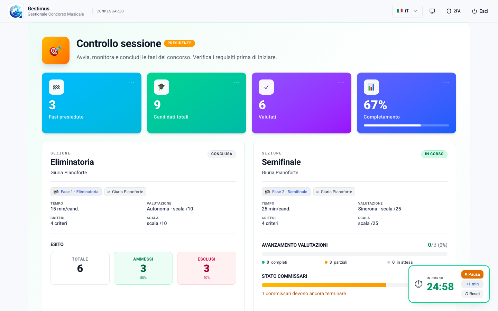

Il pannello mostra per ogni fase PIANIFICATA una lista di check con icone ✓ / ⚠ / ✗:

- **Commissione assegnata** — verifica che esista e abbia commissari attivi.
- **Criteri** — verifica che `len(criteri) > 0`.
- **Fase precedente** — se esiste, deve essere `CONCLUSA`; altrimenti blocco.
- **Candidati attesi** — almeno 1; warning se superano `ammessi`.

Se ci sono blocchi (✗) il pulsante *Avvia* è disabilitato con tooltip esplicativo. Warning (⚠) non bloccano ma vengono segnalati.

### 7.10 Modalità autonoma vs sincrona

**Autonoma** (default consigliato):

- ogni commissario procede in sequenza al proprio ritmo;
- vede il prossimo candidato non ancora votato (da lui);
- adatta a valutazioni in differita o ad audizioni con commissari indipendenti.

**Sincrona**:

- l'intera commissione vota lo **stesso candidato** in contemporanea;
- un commissario che ha già votato vede una schermata di attesa finché tutti gli altri non hanno completato;
- il presidente "pilota" l'avanzamento al prossimo candidato;
- adatta ad audizioni live con candidato sul palco e timer cronometrato.

> **Nota**: la modalità si imposta per singola fase. Le sotto-fasi di una stessa sezione possono avere modalità diverse (es. eliminatoria autonoma, finale sincrona).

### 7.11 Metodi di calcolo media

I metodi disponibili (`METODI_MEDIA` in `scoring.js`) e il loro consigliato in base al numero di commissari (`suggerisciMetodo`):

| Metodo | Quando si applica | Pro | Contro |
| --- | --- | --- | --- |
| **Aritmetica** ∑ | Sempre, default | Usa tutti i dati, trasparente | Vulnerabile a un singolo outlier |
| **Olimpica** 🥇 | Da 4 commissari in su | Annulla un outlier per estremo (scarta max + min) | Con 3 commissari resta un solo voto utile |
| **Winsorizzata** ✂️ | Da 5 commissari in su | Attenua outlier mantenendo n dati | Servono ≥5 voti significativi |
| **Mediana** ⊥ | Robusta a qualsiasi N≥3 | Massimamente robusta agli outlier | Ignora le distanze fra i voti |
| **Deviazione standard** σ | Con ≥7 commissari, idealmente 10+ | Robusta a outlier multipli | Con n<7 può scartare voti legittimi |

Suggerimenti automatici (in base a `nCommissari`):

```
n ≤ 2   → aritmetica
n = 3   → mediana
n 4–5   → olimpica
n 6–7   → mediana
n 8–12  → winsorizzata
n ≥ 13  → deviazione_std
```

La card del metodo consigliato è marcata in verde con motivazione. Puoi sempre scegliere diversamente.

### 7.12 Criteri e pesi

Ogni fase ha la propria lista di criteri (`{key, label, peso}`). Default applicato in creazione:

```
Tecnica          35%
Interpretazione  35%
Intonazione      15%
Musicalità       15%
```

Aggiungi/rimuovi criteri liberamente. Il **totale dei pesi** è ricalcolato live in alto a destra:

- 100% → font verde (raccomandato);
- diverso da 100% → font giallo, e al salvataggio chiede conferma esplicita.

> **Nota tecnica**: la `key` viene generata via `slugifyKey(label)` se non specificata manualmente. Le `key` devono essere univoche e non possono cambiare dopo aver registrato voti.

### 7.13 Timer per candidato

Se `tempo_minuti > 0`, durante la fase IN_CORSO compare un **overlay flottante** in basso a destra (`#floating-timer`) con:

- countdown HH:MM grande e tabulare;
- bordo verde (in corso), giallo (in pausa), rosso lampeggiante (scaduto);
- beep alla scadenza (Web Audio API);
- visibile a **tutti i commissari**, sincronizzato via Postgres `LISTEN/NOTIFY` + SSE;
- comandi (*Pausa / Riprendi / +1 min / Reset*) visibili **solo al presidente**.

Il timer si auto-avvia quando il presidente "cambia candidato" (la sua schermata avanza). Il record `fase_runtime` salva `started_at`, `paused_at`, `duration_seconds` e tutti i client lo guardano.

### 7.14 Sorteggio ordine candidati

Bottone *🎲 Sorteggio* sulla riga della fase. Apre conferma e poi:

- genera (o accetta esplicito) un **seed** uint32;
- esegue uno shuffle Fisher–Yates seedato (`mulberry32`) sull'array di `candidati_fase`;
- aggiorna `posizione` di ogni record;
- registra `fase.sorteggio` nell'audit con seed e count.

> **Suggerimento**: il seed è riproducibile. Se hai bisogno di rifare un sorteggio "ufficiale", annota il seed e potrai rigenerare lo stesso ordine in qualunque momento.

Bloccato se la fase è `CONCLUSA`.

### 7.15 Spareggi e rottura della parità

Quando due o più candidati ottengono la **stessa media aggregata**, il sistema deve dirimere la parità in modo meritocratico e legalmente difendibile. Gestimus applica una **cascata fissa di 4 regole** (ordine non modificabile: si parte dalla più meritocratica e si scende solo se la precedente non risolve). Ogni regola è singolarmente abilitabile/disabilitabile.

**Dove si configura**

- **Default del concorso** — nel modal *Modifica concorso* (header del concorso → bottone *Modifica*): sezione *Regole di rottura della parità (default)*. Vale per tutte le fasi che non hanno override.
- **Override di fase** — nel form fase, **Sezione 6: Regole di rottura della parità**. Se non tocchi i toggle, la fase eredita il default del concorso (compare un banner informativo).

**Le 4 regole**

1. 🧩 **Scomposizione del voto** — confronta i criteri di valutazione **uno per uno**, in ordine di **peso decrescente**. Vince chi ha la media più alta sul primo criterio che li differenzia. Esempio: pari su media `8.50` con criteri Tecnica 35% / Interpretazione 35% / Intonazione 15% / Musicalità 15% → si confronta prima la media su Tecnica, poi Interpretazione, e così via.
2. 🎯 **Voto del Presidente di giuria** — il voto del Presidente diventa decisivo: vince il candidato con la media pesata più alta calcolata **sui soli voti del Presidente**. Richiede che la fase abbia una commissione assegnata (con presidente settato).
3. 🌱 **Criterio anagrafico** — vince il candidato **più giovane** al momento dell'esibizione (`data_prevista` della fase). Per i gruppi/ensemble si usa la **media delle date di nascita dei membri**. Se manca la `data_nascita` (o nessun membro del gruppo è datato), la regola cade alla successiva.
4. 🤝 **Ex aequo (extrema ratio)** — se nessuna regola precedente risolve, viene dichiarato **ex aequo**: i candidati condividono la stessa posizione, la posizione immediatamente successiva **non viene assegnata**, e il premio previsto dal regolamento per le posizioni interessate si **somma e divide in parti uguali**. Il sistema segnala l'ex aequo; la gestione monetaria del montepremi resta fuori dal sistema (l'admin la cura secondo regolamento).

**Quando si applica**

La cascata viene eseguita **al congelamento della fase** (cioè quando il Presidente clicca *Concludi fase*). Il sistema:

1. Calcola le medie aggregate.
2. Raggruppa i candidati con la stessa media.
3. Applica la cascata sotto-gruppo per sotto-gruppo.
4. Scrive su ogni `candidati_fase` i campi `posizione_finale`, `tiebreak_log` (catena di motivazioni), `ex_aequo_group` (id condiviso tra i candidati in ex aequo).
5. Registra `tiebreak.applied` nell'audit log se almeno uno spareggio è stato applicato.

**Trasparenza nei risultati**

Nella tab *Risultati* compaiono:

- Badge **⚖ N spareggi** nell'header della fase quando ci sono state parità risolte.
- Badge **🤝 N ex aequo** se sono dichiarati ex aequo.
- Riga della classifica con icona **⚖** accanto al nome quando quel candidato è stato risolto da uno spareggio (tooltip con la motivazione esatta).
- Righe in viola per gli ex aequo (stessa posizione con suffisso "ex aequo").
- Accordion **Dettaglio spareggi applicati** in fondo alla card, con la catena delle regole applicate per ogni candidato.
- Banner informativo **Nota ex aequo** che spiega la non-assegnazione della posizione successiva e la divisione del montepremi.

**Nel verbale**

I tag dinamici `<spareggi>` (livello concorso) e `<fase_spareggi>` (livello fase) generano automaticamente il blocco testuale degli spareggi, già pronto per essere stampato nel verbale ufficiale. Vedi capitolo 10.3.

> **Importanza legale.** L'assenza di una regola di rottura della parità dichiarata in regolamento è una causa frequente di reclami e annullamento del verbale. Mantieni almeno **scomposizione** + **ex aequo** sempre attive: garantisce una catena meritocratica con chiusura difendibile per ogni caso residuo.

<!-- page-break -->

## 8. Iscrizioni

### 8.1 Tab Iscrizioni

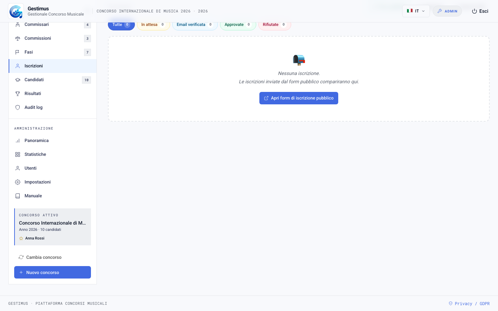

La tab elenca tutte le iscrizioni ricevute via form pubblico, con pillole-filtro per stato:

- **Tutte**, **In attesa** (pending), **Email verificata** (email_verified), **Approvate** (approved), **Rifiutate** (rejected).

Pulsanti in alto a destra:

- *Form pubblico* (apre `#/iscrizione` in nuova scheda);
- *Aggiorna* (ricarica via PB);
- *Esporta CSV* (scarica le iscrizioni filtrate).

### 8.2 Form pubblico

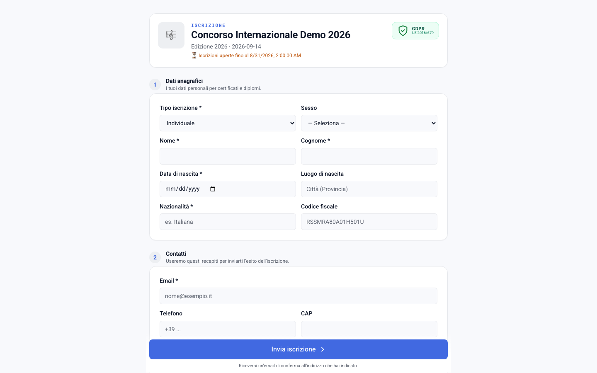

Il candidato accede a `/#/iscrizione` (link visibile in fondo alla pagina di login). Il form è single-page e raccoglie *(v2.0: schema esteso)*:

- **Dati anagrafici**: nome, cognome, sesso, data nascita, luogo di nascita, codice fiscale, nazionalità;
- **Contatti**: email, telefono, indirizzo, città, CAP, provincia, paese;
- **Dati artistici**: strumento, tipo (individuale/gruppo), **sezione → categoria** (cascata: scegli sezione, poi vedi le sue categorie; se la sezione ha categorie diventa obbligatorio sceglierne una), anni di studio, scuola di provenienza, docenti preparatori, **nome gruppo** (solo per tipo gruppo);
- **Programma**: lista brani con titolo, autore, durata in minuti;
- **Allegati**: foto, documento d'identità, ricevuta pagamento, autorizzazione minore (campi presenti in UI, l'upload end-to-end è ancora in via di completamento — la tabella `iscrizioni_allegati` esiste lato DB);
- **Tutore**: obbligatorio per minori di 16 anni (soglia GDPR Art. 8), 4 campi (nome, cognome, email, telefono) aggregati in JSONB `tutore`;
- **Consensi GDPR**: privacy + regolamento obbligatori, uso immagini opzionale. Aggregati in JSONB `consensi_gdpr`;
- **Note libere**: textarea opzionale.

**Validazione server**: gerarchia categoria→sezione e cross-concorso. Se l'utente passa solo `categoriaId` (es. da import o manipolazione), la `sezioneId` viene derivata automaticamente. Se invece passa una sezione di un altro concorso, → `400`.

Il form ha protezioni anti-bot stateless:

- **honeypot** (campo `website` invisibile, riempito solo dai bot → rifiutato);
- **min time-on-page** di 5 secondi tra apertura form e submit;
- **rate-limit** delegato a nginx in produzione (5r/min per IP).

### 8.3 Workflow approvazione

Stati possibili (`iscrizioni.stato`):

```
pending          → appena inviata, manca conferma email
email_verified   → il candidato ha cliccato il link nella mail di benvenuto
approved         → l'admin l'ha approvata, è stato creato il record candidato
rejected         → l'admin l'ha rifiutata (con motivo facoltativo)
```

Per ogni iscrizione l'admin può:

- **Approvare** — crea un record `candidati` con dati pre-compilati (nome, cognome, strumento, data nascita, sezione, categoria, docenti) e invia email "Iscrizione approvata";
- **Rifiutare** — chiede motivo, invia email "Aggiornamento sulla tua iscrizione";
- **Vedere dettaglio** — mostra tutti i campi raccolti, gli allegati, eventuale tutore.

La route `POST /api/public/iscrizioni` (`server/src/routes/iscrizioni.ts`) gestisce automaticamente:

- forza `stato='pending'` in creazione (ignora valori inviati dal client);
- rigenera `token_verifica` con 40 caratteri crittografici;
- verifica concorso ATTIVO + iscrizioni_aperte + non scaduto;
- esige tutore_* per minori di 16 anni;
- invia email di benvenuto con link di verifica;
- alla transizione `approved` senza `candidato` legato, crea il record `candidati` e collega.

### 8.4 Privacy

L'informativa è accessibile a `#/privacy` ed è linkata dal form (badge GDPR verde "Conforme GDPR · Regolamento UE 2016/679"). Il modulo descrive:

- finalità del trattamento (gestione iscrizione, valutazione, premiazione);
- base giuridica (consenso + esecuzione contratto + obbligo legale);
- durata conservazione, diritti dell'interessato, dati di contatto del Titolare;
- consenso immagini (foto/video per pubblicazioni) — opzionale.

I dati del Titolare e DPO si configurano nelle impostazioni del tenant (cap. 12).

<!-- page-break -->

## 9. Candidati

### 9.1 Tab Candidati

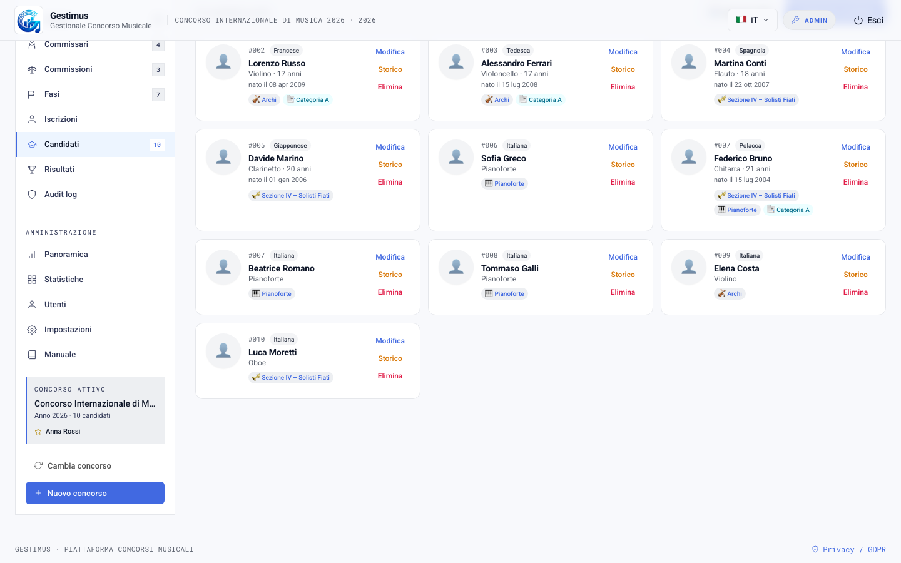

Griglia di card candidato con:

- numero candidato (`#001`, `#002`, ...) assegnato automaticamente in sequenza;
- nome, cognome, strumento, età, nazionalità;
- badge "GRUPPO" se è un candidato di tipo gruppo;
- chip sezioni e categorie di appartenenza;
- foto (auto-ridimensionata a 480 px);
- chip docenti preparatori (con tooltip se troppi);
- pulsanti *Modifica / Membri (per gruppi) / Storico / Elimina*.

In alto: contatore totale, pulsanti *Importa* e *Aggiungi*.

### 9.2 Creare un candidato

Il form richiede:

- **Nome**, **cognome**, **strumento**, **data di nascita**, **nazionalità** (obbligatori per candidati individuali);
- **Tipo** (individuale/gruppo): per i gruppi solo nome+strumento sono obbligatori — cognome e data di nascita diventano dinamicamente opzionali al cambio del select;
- **Foto** (opzionale);
- **Docenti preparatori** (uno per riga in textarea);
- **Sezione e categoria** *(v2.0: modello N:1)*: **radio button**, una sola sezione + una sola categoria della sezione. Selezionando una categoria, la sezione padre viene auto-selezionata (gerarchia categoria→sezione). Se la sezione ha categorie, è obbligatorio sceglierne una.

Salvando, viene creato con `numero_candidato` = ultimo + 1 del concorso.

### 9.3 Candidati gruppo

Per i candidati di tipo *gruppo* (es. quartetti, ensemble), il pulsante *Membri* apre una modale dove inserisci i dati dei membri direttamente (nome, cognome, strumento, data nascita). I membri vengono salvati nella tabella `candidati_membri` legati al candidato-gruppo via `candidato_id`. **Non sono record candidato a sé stanti**: il "candidato" di gruppo è l'ensemble nel suo complesso.

> **Nota piano SaaS**: un'iscrizione di gruppo conta come N persone fisiche, quante sono nei membri. Un quartetto conta come 4 iscritti del piano annuale.

### 9.4 Storico candidato

Cliccando *Storico* su una card si apre una modale che cerca, sull'intero tenant, candidati con stesso nome+cognome (normalizzati) e mostra in quali concorsi degli anni precedenti hanno partecipato, con conteggi fasi/esibizioni/valutazioni. Comodo per i ritorni anno dopo anno.

### 9.5 Import CSV/TSV

Bottone *Importa*. Modale con:

- area di **incolla**, oppure pulsante *Carica file* (`.csv`, `.tsv`, `.txt`);
- pulsante *Scarica template* (CSV pre-compilato con header e una riga di esempio);
- separatore auto-rilevato (virgola/tab/punto-virgola);
- *Anteprima* tabella con check di validità per riga;
- mappatura colonne sorgente → campi del modello candidato (modificabile);
- importazione in batch con barra di avanzamento.

Esempio template candidati *(v2.0)*:

```csv
nome,cognome,strumento,data_nascita,nazionalita,docenti,sezione,categoria,tipo,gruppo_nome
Anna,Rossi,Pianoforte,2002-04-15,Italiana,Mario Bianchi|Lucia Verdi,Pianoforte,Junior,individuale,
Marco,Bianchi,Violino,15/06/2003,Italiana,Anna Neri,Archi,Senior,individuale,
Quartetto Brillante,,Quartetto d'archi,,,,Archi,Cameristica,gruppo,Quartetto Brillante
```

- **`sezione`** / **`categoria`** sono **singolari** (modello N:1). Se la sezione ha categorie ma non viene specificata, la sezione viene auto-derivata dalla categoria scelta.
- **`tipo`**: `individuale` (default) o `gruppo`. Per i gruppi: `cognome` e `data_nascita` opzionali; `gruppo_nome` può essere valorizzato per dare un nome esplicito all'ensemble.
- Date accettate: `YYYY-MM-DD` (ISO) o `DD/MM/YYYY`. Docenti separati da `|`.

> **Suggerimento**: usa la stessa modalità per importare commissari (template diverso: nome, cognome, specialita, email, telefono, data_nascita, nazionalita, bio).

### 9.6 Eliminazione

Conferma standard. Elimina anche `candidati_fase` e `valutazioni` collegate via cascade del DB.

<!-- page-break -->

## 10. Risultati

### 10.1 Tab Risultati

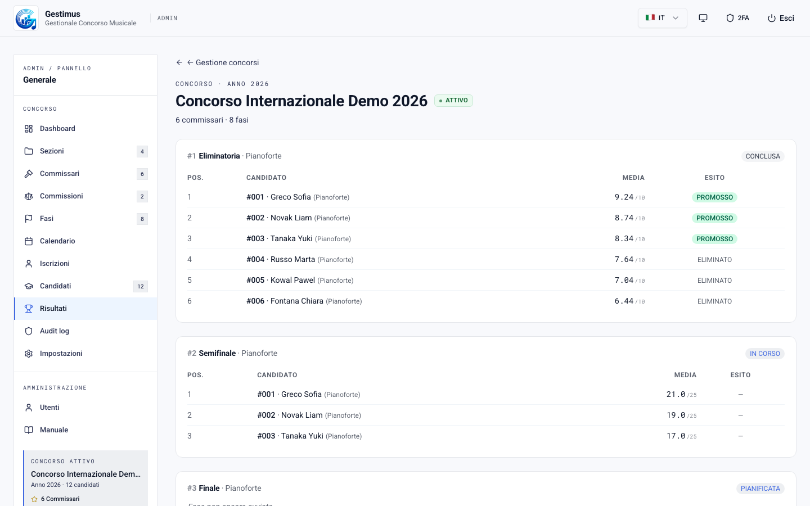

La tab mostra:

1. **Per ogni fase un riepilogo** con titolo che include lo scope di sezione (es. `#3 🎺 Eliminatoria · Fiati`), stato, tabella classifica ordinata per media discendente. Per ogni candidato: posizione, numero, nome, strumento, media (formattata in base alla scala), esito (Promosso/Eliminato/In attesa).
2. **Podio** (se l'ultima fase è CONCLUSA): primo/secondo/terzo posto con medaglie 🏆🥈🥉 e media, più sezione "Menzioni" per chi è oltre il terzo.
3. **Generatore verbale** (cap. 10.3).
4. **Pulsanti export**: *Esporta PDF* (protocollo ufficiale) e *Esporta CSV*.

### 10.2 Export protocollo PDF

Cliccando *Esporta PDF* viene generato un PDF A4 con:

- header con logo del concorso + titolo + sottotitolo (anno + data export);
- tag "Modalità anonima" se attiva;
- per ogni fase con candidati: header `#ordine Nome · Scope sezione` + tabella classifica (Pos, Num, Candidato, Strumento, Media, Esito);
- esito colorato (verde "PROMOSSO", rosso "ELIMINATO");
- ultima pagina: riga firma del presidente con nome stampato;
- numerazione pagine.

Il file viene salvato come `Protocollo_<Nome_Concorso>_<Anno>.pdf`.

### 10.3 Generatore verbale con tag dinamici

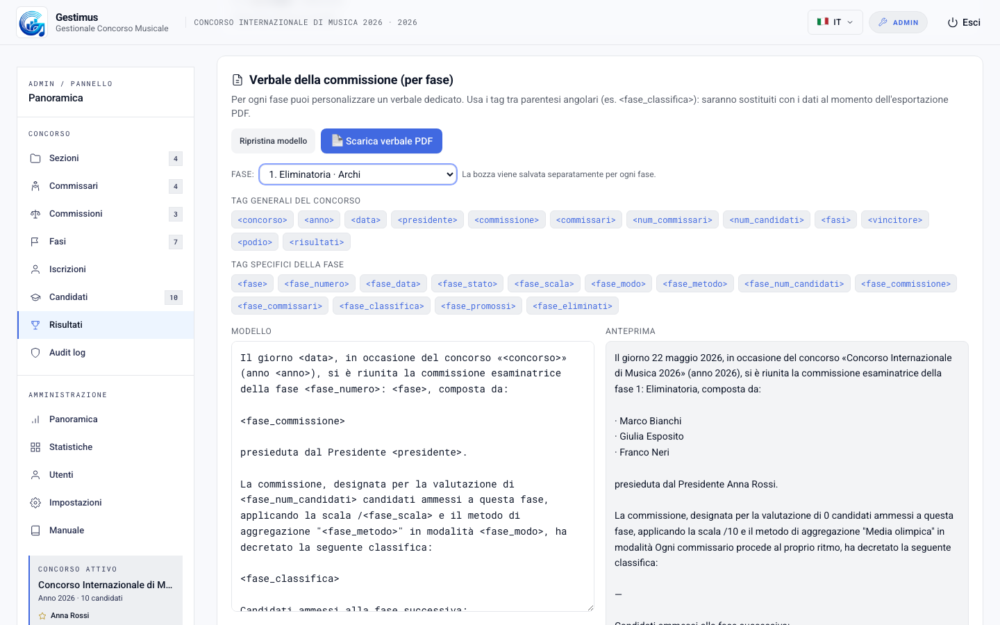

Il blocco *Verbale della commissione* permette di scrivere un template testuale con **tag** che vengono sostituiti dinamicamente. Selezionando la fase dal dropdown in alto, i tag fase-specifici si aggiornano.

**Tag generali**:

```
<concorso>          nome del concorso
<anno>              anno
<data>              data odierna
<presidente>        nome del presidente
<commissione>       elenco commissari (uno per riga)
<commissari>        commissari inline (virgola)
<num_commissari>    numero commissari
<num_candidati>     numero candidati totali
<fasi>              lista fasi (1. Eliminatoria, 2. Finale...)
<vincitore>         nome del primo classificato
<podio>             podio 1°/2°/3°
<risultati>         classifica completa per fase
<spareggi>          elenco degli spareggi applicati in tutto il concorso
                    (regola vincente per ogni parità risolta + ex aequo)
```

**Tag specifici della fase selezionata**:

```
<fase>              nome fase
<fase_numero>       ordine
<fase_data>         data prevista
<fase_stato>        PIANIFICATA/IN_CORSO/CONCLUSA
<fase_scala>        scala di voto
<fase_modo>         autonoma/sincrona
<fase_metodo>       metodo di media
<fase_num_candidati>
<fase_commissione>  commissari della fase
<fase_classifica>   classifica completa
<fase_promossi>     elenco promossi
<fase_eliminati>    elenco eliminati
<fase_spareggi>     spareggi applicati nella fase selezionata
                    (vincitori + ex aequo, con motivazione)
```

> **Suggerimento per il verbale.** Inserisci `<spareggi>` (o `<fase_spareggi>`) in un paragrafo dedicato del template — per ogni parità risolta verrà stampata la posizione, il candidato e la regola applicata (es. "Vince su scomposizione del voto (criterio Tecnica)" oppure "ex aequo dichiarato"). Se non ci sono stati spareggi viene scritto "Nessuno spareggio applicato".

Anteprima live a destra del template. Bozza salvata in `localStorage` per concorso+fase. Pulsante *Reset* per ripristinare il template default.

**Export verbale PDF** genera un documento con:

- header con logo + "Verbale della commissione — Fase N: Nome";
- corpo testuale a paragrafi (split su `\n`, wrap automatico);
- **griglia firme** in fondo: una riga per ogni commissario della fase, con linea per firma, nome + (Presidente) per il presidente, specialità sotto. Layout a 2 colonne.

### 10.4 Export CSV

File `<Nome>_risultati.csv` con header:

```
Fase,Posizione,Numero,Nome,Cognome,Strumento,Nazionalita,Eta,Media,Esito
```

BOM UTF-8 per Excel, protezione anti formula-injection (prefisso `'` per valori che iniziano con `=`, `+`, `-`, `@`, tab, CR).

<!-- page-break -->

## 11. Audit log

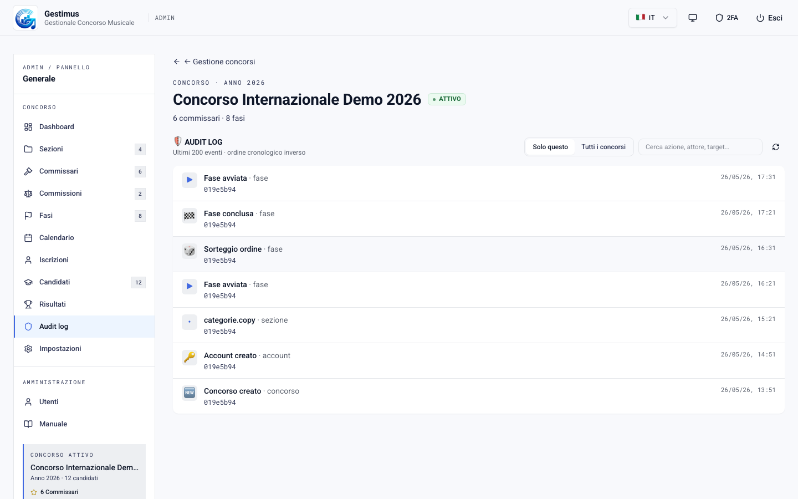

Il tab *Audit* mostra il log delle azioni rilevanti. Per ogni riga: icona, etichetta tradotta, attore (email + ruolo), target, timestamp.

**Scope**: pulsanti in alto destra per filtrare *Solo questo concorso* / *Tutto il tenant*. Campo di ricerca testuale che filtra per action, attore, target.

**Azioni tracciate**:

```
auth.login              login utente
auth.logout             logout utente
account.create          nuovo account
account.delete          account eliminato
account.password_reset  reset password
concorso.create         nuovo concorso
concorso.delete         concorso eliminato
fase.start              fase avviata (presidente)
fase.complete           fase conclusa (presidente)
fase.sorteggio          sorteggio ordine candidati (con seed)
fase.timer_bonus        +N secondi al timer (presidente)
categorie.copy          copia categorie tra sezioni
```

L'audit è **best-effort**: non blocca mai l'azione di business se il log fallisce (try/catch interno + `.catch()` sui caller).

<!-- page-break -->

## 12. Impostazioni del tenant *(v2.0)*

La tab *Impostazioni* (sidebar admin → sezione "Admin") configura il branding dell'**ente**. Internamente i dati sono spalmati su due colonne JSONB della tabella `tenants`:
- `enteSettings`: dati interni (email, telefono, sede, codice fiscale, PEC, sito web, note)
- `brandingPublic`: dati visibili pre-login (nome pubblico, logo come dataURL inline, colori, sottotitolo)

Le PATCH server fanno **merge** (non overwrite): inviare solo il campo da cambiare lascia gli altri intatti.

### 12.1 Logo

Caricato con il selettore file. Formati supportati: PNG, JPEG, WEBP. L'immagine viene ridimensionata client-side a max 800px (`readImageResized`, preserva PNG/WebP per la trasparenza, JPEG ricompresso). Salvato come dataURL inline in `brandingPublic.logoUrl`.

### 12.2 Nome e descrizione

Il **nome ente** è obbligatorio. Compare:

- nell'header dell'app;
- nella pagina di login (panel di sinistra);
- nei PDF (subtitle del protocollo, contesto del verbale).

### 12.3 Contatti

Email, telefono, sito web, indirizzo, sede, codice fiscale, PEC, note. Non sono pubblici (visibili solo agli admin loggati). Per dati pubblici vedi *Branding pubblico* (cap. 12.5).

### 12.4 Branding (colori)

Due color picker per primario e secondario. Il valore viene mostrato sia con picker grafico sia come testo `#RRGGBB` modificabile. Sincronizzati: cambiando uno aggiorna l'altro. Salvati in `brandingPublic.coloreAccent` e `coloreSfondo`.

### 12.5 Branding pubblico

L'endpoint `GET /api/ente/public` è accessibile pre-login (senza auth, niente RLS) e restituisce solo `brandingPublic`: nome pubblico, logo, colori. Mai email/telefono/indirizzo. Usato dalla pagina di login e dall'header dell'app prima dell'autenticazione.

### 12.6 Impostazioni concorso (inline) *(v2.0)*

La tab *Impostazioni concorso* (sotto la sidebar del concorso, non delle Impostazioni ente) ora ha il pannello **Modifica concorso embedded inline** — niente più modale "Modifica". Modifichi nome, anno, stato, modalità anonima, iscrizioni aperte, scadenza, tiebreak default e logo concorso direttamente nella tab, con bottone "Salva impostazioni" in fondo.

**Zona pericolosa — Eliminazione concorso**: doppia conferma a due step:
1. Prima conferma generica con counts (X candidati, Y fasi, Z commissari verranno cancellati).
2. Modal di **type-to-delete** in stile GitHub: devi digitare il nome esatto del concorso per sbloccare il bottone "Elimina definitivamente". L'operazione è transazionale e irreversibile.

### 12.6 Piano SaaS

Il piano è impostato dal superadmin di piattaforma (non dall'admin di tenant). L'admin lo vede tramite il record singleton `tenant_config` che contiene:

- `piano` (trial, starter, pro, ultra, ppe);
- `piano_inizio`, `piano_scadenza`, `grace_giorni`;
- `limit_concorsi`, `limit_iscritti_annui`;
- `ppe_setup_per_concorso`, `ppe_per_iscritto` (per il piano pay-per-event).

Le quote sono **applicate server-side**:

- `limit_concorsi`: blocco alla creazione di un nuovo concorso se i concorsi non `CONCLUSO` raggiungono il limite;
- `limit_iscritti_annui`: blocco alla creazione di una nuova iscrizione se il ciclo annuale (dall'anniversario di `piano_inizio`) supera il limite. Un'iscrizione gruppo conta come N persone (i `gruppo_membri`);
- `piano_scadenza + grace_giorni`: bloccate tutte le creazioni di concorsi e iscrizioni.

I messaggi di errore sono espliciti: "Limite del piano raggiunto: 50/50 iscritti..." / "Piano scaduto il 15/03/2026...".

### 12.7 SMTP *(v2.0)*

La configurazione SMTP è **per-tenant** (ogni ente può usare il proprio provider, es. SendGrid, Mailgun, server SMTP del conservatorio). Sezione gestita dal **super-admin** della piattaforma, non dall'admin di tenant: chi gestisce il provisioning vede tutti gli enti nella tab "Gestione Enti" del super-admin e configura per ognuno host/porta/user/password/from.

La password viene **cifrata at-rest** con AES-256-GCM usando `GESTIMUS_SECRET_KEY` (variabile d'ambiente del server). Il prefisso `enc:v1:` distingue i record cifrati. Per testare la config, c'è un bottone "Test invio" nella riga del tenant.

> Email transazionali in arrivo (M.6): benvenuto iscrizione, conferma email, notifiche approvazione/rifiuto. Lo stack SMTP tenant-aware è pronto, manca solo il template + invio nel route `/api/public/iscrizioni`.

<!-- page-break -->

## 13. Dashboard e statistiche

### 13.1 Dashboard admin

La tab *Dashboard* mostra KPI sintetici:

- **Concorsi** (attivi / totali)
- **Fasi in corso**
- **Candidati totali**
- **Valutazioni totali**
- **Commissari totali**
- **Account utente totali**

Sotto, un box "Info ente" riepiloga email, telefono, sito, indirizzo del tenant. Se nessun ente è configurato, banner giallo con link diretto a *Impostazioni*.

### 13.2 Statistiche


La tab *Statistiche* è centrata sul **concorso attivo** e mostra:

- **Distribuzione strumenti** — top 8, con barre orizzontali proporzionali.
- **Distribuzione nazionalità** — barre con colore accent.
- **Riepilogo per fase** — tabella con candidati, valutazioni registrate, ammessi, tasso di promozione %.

Utile per relazioni post-concorso e per identificare squilibri (es. troppi pianisti, sezione fiati sotto-rappresentata).

<!-- page-break -->

## 14. Multi-lingua

Gestimus supporta **italiano** (default), **inglese**, **francese**, **spagnolo**. Il selettore lingua è nell'header dell'app (icona bandiera + codice ISO):

```
🇮🇹 IT   🇬🇧 EN   🇫🇷 FR   🇪🇸 ES
```

Cliccando il selettore si apre un menu con le quattro lingue. La scelta è persistita in `localStorage` (`gc_lang`) e applicata immediatamente:

- ricarica tutte le stringhe statiche marcate `data-i18n`;
- emette un evento `langchange` che fa re-renderizzare le viste dinamiche.

Le traduzioni sono in `js/i18n.js` come dizionari per chiave (`SUPPORTED_LANGS = ['it','en','fr','es']`). Il fallback per chiavi mancanti è: lingua corrente → italiano → chiave letterale.

> **Nota**: i contenuti **creati dall'admin** (nomi di sezioni, categorie, fasi, commissari, template verbali) non vengono tradotti: sono testo libero. Se servi un pubblico multilingue, usa nomi neutri (es. "Junior" anziché "Giovani").

<!-- page-break -->

## 15. Sicurezza e integrità dati

Gestimus implementa più livelli di protezione lato server: middleware Fastify (autenticazione, RLS per-tenant, guard di ruolo), trigger DB, vincoli unique e validazione Zod sulle route. Riferimento codice: `server/src/routes/` + `server/src/db/policies.sql`.

### 15.1 Fasi (`server/src/routes/fasi.ts`)

- `assertCanManageFase`: per ogni mutazione su una fase (start, stop, sorteggio, timer) verifica che l'utente sia `admin` del tenant **oppure** presidente della commissione assegnata alla fase. Senza questo controllo, un presidente di Commissione A potrebbe avviare/chiudere una fase di Commissione B con una PATCH diretta.
- La creazione/eliminazione di fasi è riservata ad `admin`/`superadmin` (`requireAdmin`).

### 15.2 Valutazioni (`server/src/routes/valutazioni.ts` + trigger DB)

- **Clamp voto** in `[0, fase.scala]` via trigger `clamp_voto`: un voto malformato/negativo viene normalizzato prima dell'INSERT/UPDATE.
- **Freeze fase CONCLUSA** via trigger `freeze_valutazioni_on_fase_conclusa`: nessun create/update accettato (la fase chiusa è uno "snapshot" inalterabile).
- **Unique index** `(candidato_fase, commissario, criterio)` garantisce un solo voto per criterio/commissario.

### 15.3 Accounts (`server/src/routes/auth.ts` + `server/src/routes/admin/accounts.ts`)

Anti **privilege escalation**: i campi sensibili (`role`, `attivo`, `commissario`, `email`, `verified`) sono modificabili solo da un admin del tenant (o superadmin per gli admin). Un commissario può aggiornare solo `password`, `nome`, `cognome`. La creazione di account è chiusa a `requireAdmin`: nessun endpoint pubblico crea account, niente self-signup.

### 15.4 Iscrizioni (`server/src/routes/iscrizioni.ts`)

- forza `stato='pending'` in creazione (ignora valori inviati);
- rigenera `token_verifica` server-side con `crypto.randomBytes(20).toString('hex')`;
- azzera campi gestiti solo dall'admin (`approved_*`, `candidato`, `verified_at`, `note_admin`);
- verifica consensi GDPR obbligatori === true;
- verifica che il concorso sia ATTIVO + iscrizioni aperte + non scaduto;
- esige tutore_* per minori di 16 anni;
- **anti-bot**: honeypot (`website` vuoto) + min time-on-page 5 secondi + rate-limit applicativo (`@fastify/rate-limit`, 3/h e 10/giorno per IP);
- **rate-limit edge**: vedi anche `deploy/nginx-snippet-rl.conf`.

### 15.5 Plan gating (`server/src/services/plan-gating.ts`)

Middleware che applica i limiti del piano (max enti, max concorsi attivi, max commissari/candidati per concorso) prima delle mutazioni. Le quote sono lette dal record tenant in `tenants.piano` ed espresse in JSONB; il super-admin le modifica dalla UI piattaforma (niente API esterna da chiamare).

### 15.6 Row-Level Security (`server/src/db/policies.sql`)

Ogni connessione applicativa setta `app.tenant_id` (dal sottodominio risolto dal middleware tenant). Le policy RLS filtrano automaticamente ogni `SELECT/INSERT/UPDATE/DELETE` a livello DB: un eventuale bug di route che dimenticasse il filtro `WHERE tenant_id = …` non causa data leak cross-tenant — Postgres rifiuta la query. Il super-admin usa il ruolo `gestimus_super` che bypassa RLS (sa cosa sta facendo).

### 15.7 Backup

Backup quotidiano del database Postgres (logico, `pg_dump`) + filesystem `uploads/<tenant_slug>/` con rotazione almeno settimanale. Vedi `docs/DEPLOY-IONOS.md` per gli script di esempio e la retention pre-hard-delete del soft-delete tenant.

<!-- page-break -->

## 16. Calendario e scheduling

La tab **Calendario** (sidebar admin) permette di pianificare lo svolgimento del concorso su una **board drag-and-drop a due livelli**: gli *eventi* (sessioni/fasi) e le *sale* in cui si svolgono.

### 16.1 Sale ed eventi

- **Sale**: gli spazi fisici (es. *Auditorium*, *Sala A*). Si creano/rinominano/eliminano dalla board.
- **Eventi**: blocchi temporali collegati a una fase (e opzionalmente a sezione/categoria). Ogni evento occupa una sala in una data/ora.

### 16.2 Slot dei candidati

Per ogni evento si possono **generare gli slot** dei candidati (un turno per candidato) e poi **riordinarli** trascinandoli. L'ordine può seguire il sorteggio della fase o essere sistemato a mano. Gli slot mostrano candidato, sala e orario.

### 16.3 Pubblicazione e pagina pubblica

L'admin decide cosa esporre al pubblico tramite le **pubblicazioni**: si genera un **token** che dà accesso a una pagina pubblica di sola lettura (nessun login), consultabile da candidati e accompagnatori. Si può scegliere se mostrare o meno la commissione. La pagina è raggiungibile all'URL pubblico del calendario con il token generato.

### 16.4 Export PDF

Dalla board si esporta il calendario in **PDF** (giorni × sale, con gli slot dei candidati) per stampa/affissione.

<!-- page-break -->

## 17. FAQ e troubleshooting

### Il presidente non vede il pulsante "Avvia"

Cause più comuni:

1. **Non è effettivamente presidente** della commissione assegnata alla fase. Verifica da *Commissioni* → la card della commissione mostra il presidente in alto a destra.
2. **La fase non ha una commissione assegnata** e il presidente cerca il proprio account in `accounts.commissario` ma non trova un legame. Soluzione: in *Modifica fase* assegna una commissione.
3. **Pre-flight check con blocchi** (✗): leggi la lista nel pannello presidente — manca la commissione, mancano criteri, la fase precedente non è conclusa, o non ci sono candidati attesi.
4. **Fase precedente IN_CORSO**: anche se "su un'altra sezione", verifica con `findPreviousFaseInChain` (cap. 7.7) chi è il vero predecessore secondo lo scope.

### Il commissario non vede candidati ("Tutti valutati" o schermo vuoto)

- In **modalità autonoma**: il commissario ha già votato tutti i `candidati_fase` della fase corrente → schermata "Tutti valutati", normale.
- In **modalità sincrona**: il commissario ha votato il candidato corrente ma altri non ancora → schermata "In attesa che gli altri commissari finiscano" — chiedi al presidente di sollecitare i ritardatari.
- **Non è membro della commissione assegnata**: viene rimandato a `renderNotAssigned`. Verifica in *Commissioni* che sia nella lista membri.
- **Non c'è alcuna fase IN_CORSO**: schermata "Nessuna fase in corso" con icona ⏸️. Il presidente deve avviare una fase.

### I pesi dei criteri non sommano 100%

Non è un errore bloccante: il sistema funziona anche con altri totali (la media viene comunque calcolata come Σ(voto·peso)). Tuttavia il **risultato finale non è confrontabile** con la scala di voto. Esempio: scala 10, pesi 50%+50%, voti 8 e 8 → media 8.0. Se i pesi sono 50%+30%, stessi voti → media 6.4 (su 8). Per leggibilità mantieni `Σ = 100%`.

Il form chiede conferma esplicita se Σ ≠ 100.

### Ho assegnato la commissione sbagliata a una fase

Apri *Modifica fase* → sezione 5 "Restrizione e assegnazione" → cambia il dropdown *Commissione assegnata*. Se la fase è già `IN_CORSO`, il cambio è ancora possibile ma comporta:

- i commissari della nuova commissione vedranno la fase apparire nella loro lista;
- i voti già registrati dai commissari della vecchia commissione restano validi (non vengono cancellati) ma non saranno più "completati" dal punto di vista della commissione attuale.

Conviene **concludere la fase corrente, eliminarla, e ricrearla** con la commissione corretta se ci sono stati pochi voti.

### Email di benvenuto iscrizione non arrivano

Verificare in ordine:

1. SMTP configurato per il tenant dalla console super-admin (*Tenant → Impostazioni → SMTP*); le credenziali sono cifrate at-rest in AES-GCM.
2. log del server Node (`journalctl -u gestimus -f` su systemd, o `pm2 logs`): cerca `email send failed` / `nodemailer error`;
3. `senderAddress` non blacklistato dal mail server destinatario;
4. cartella spam del destinatario.

La route iscrizioni non blocca la creazione dell'iscrizione se l'email fallisce: il record viene salvato comunque e l'admin può approvare manualmente.

### Limite del piano raggiunto creando un concorso/iscrizione

Messaggio tipico: `Limite del piano raggiunto: 5/5 concorsi attivi. Concludi un concorso esistente o passa a un piano superiore.`

Soluzioni:

- **Concludere un concorso** (cambia stato a CONCLUSO da *Modifica concorso*): smette di contare nel limite.
- **Chiedere al superadmin di piattaforma di cambiare piano** (es. da Starter a Pro): il limite viene aggiornato automaticamente via endpoint `/api/admin/apply-plan`.

Per le iscrizioni, il conteggio è annuale e considera le persone fisiche: un'iscrizione di un quartetto conta 4. Vedi cap. 12.6.

### Il timer non parte / non è sincronizzato

- Verifica `tempo_minuti > 0` sulla fase (un tempo = 0 disabilita l'overlay).
- Solo il presidente può avviare/pausare/resettare; gli altri commissari vedono solo il countdown.
- Se il timer mostra orari sballati, controlla che gli orologi di server e client siano sincronizzati (NTP). Il calcolo usa il `started_at` server + clock client.

### Voto fuori range / errori al salvataggio

Il trigger DB `clamp_voto` normalizza i voti tra 0 e `scala`. Se vedi errori, può essere:

- **scala non impostata** → default 10;
- **fase CONCLUSA**: nessuna modifica accettata (trigger `freeze_valutazioni_on_fase_conclusa`). Errore: `La fase è conclusa: non è possibile modificare i voti`. Per intervenire è necessario riaprire la fase (`UPDATE fasi SET stato = 'IN_CORSO'` lato DB, sconsigliato fuori da incidenti).

### Ho eliminato per sbaglio un concorso / una fase

Non c'è un cestino. L'eliminazione è cascata sul database. Soluzioni:

- ripristino da backup Postgres (vedi `DEPLOY-IONOS.md` per la procedura `pg_restore`);
- se è recente e non c'è stato altro traffico, il superadmin può ripristinare il singolo concorso da un dump puntuale (`pg_dump --table` selettivo prima dell'incidente).

> **Avvertenza**: l'eliminazione di un concorso elimina tutte le sue fasi, candidati, commissari, sezioni, commissioni, valutazioni. Per i concorsi terminati conviene **archiviare** (cambiare stato ad `ARCHIVIATO`) anziché eliminare.

### Il superadmin ha cambiato piano ma le quote non si aggiornano

Il piano è memorizzato direttamente nella riga `tenants.piano` (JSONB): le modifiche del super-admin sono immediatamente visibili al middleware di plan gating (nessuna propagazione asincrona). Se le quote sembrano stantie:

- il super-admin ha effettivamente salvato dal pannello (controlla in `tenants` il valore di `piano`);
- la sessione admin del tenant ha letto il piano cached (logout/login risolve);
- log del server: cerca `plan-gating: quota exceeded` o errori di scrittura su `tenants`.

### Dove trovo il manuale dentro l'app?

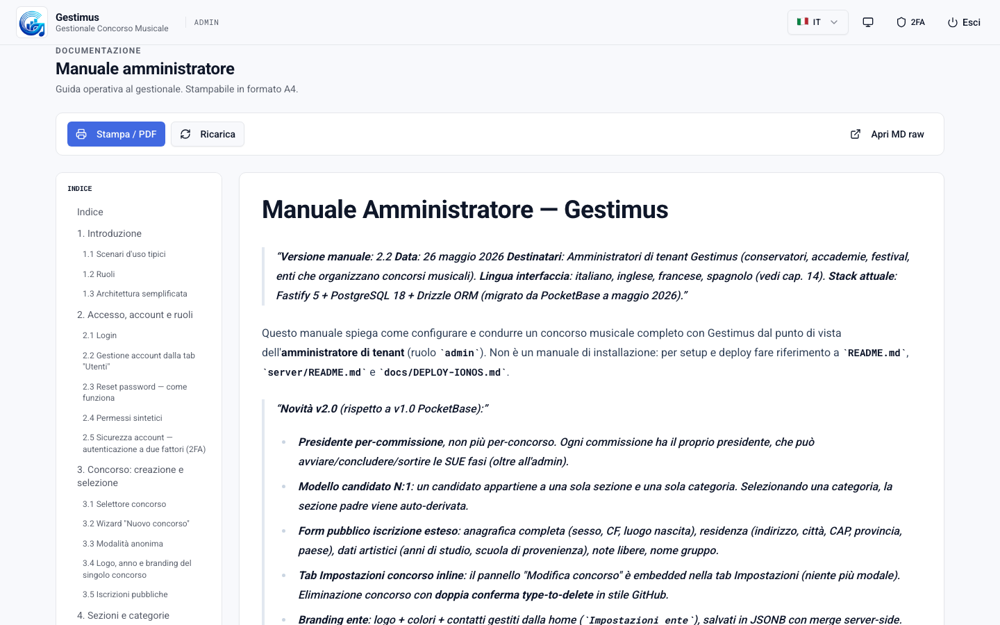

Il manuale è renderizzato come pagina interna accessibile dalla sidebar admin → sezione *Admin* → *Manuale*. È la stessa versione che stai leggendo, generata dal Markdown in `docs/manuale-admin.md`.

---

*Documento mantenuto dal team Gestimus. Per segnalazioni e proposte di miglioramento, contattare il superadmin di piattaforma o aprire una issue nel repository del progetto.*
